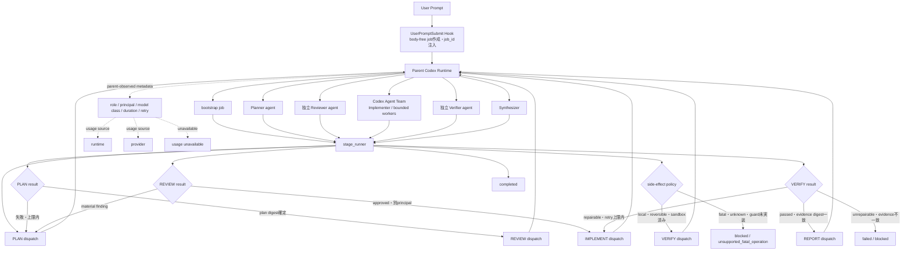

# Adaptive Orchestrator workflow

この図は、Hook、親Codex Runtime、`stage_runner`、Agent Teamの責務を分離した現行Phase 1の実行経路を示す。

## 実行責務

| 構成要素 | 責務 |
|---|---|
| UserPromptSubmit Hook | 本文を保存せずjobを作成し、`job_id`とrunner入口を注入する |
| Parent Codex Runtime | runnerを呼び、Agent Teamを実際に起動し、親が観測した結果を返す |
| `stage_runner` | 状態、lease、dispatch、retry、principal、artifact、証跡を管理する |
| Planner | 目的、task、受入条件、write scope、side-effect分類を作る |
| Reviewer | Plannerと独立した文脈でmaterial findingを検査する |
| Agent Team | reviewed planの実装をbounded taskへ分担する |
| Verifier | テスト、artifact digest、受入条件、権限境界を検証する |
| Synthesizer | 検証済み結果と実行メタデータを報告する |

## 重要な境界

- `stage_runner`はモデルやツールを起動しない。親Runtimeへ`runtime_action_v1`を返すだけである。
- Agentが直接副作用ツールを持つことは禁止し、親Runtimeのsandbox境界を通す。
- fatal操作は現Phaseでは承認後も実行しない。PreToolUse guardの実装・検証後に別Phaseで解禁する。
- `runtime`または`provider`がusageを返した場合だけ記録する。取得不能時は`usage unavailable`とし、推測しない。
- REVIEW、IMPLEMENT、VERIFYは親Runtimeが異なるprincipalを観測できなければ停止する。
- VERIFY失敗は`repairable`かつretry上限内の場合だけIMPLEMENTへ戻す。証跡不一致や権限違反は自動修復しない。

## User-visible status

The parent Runtime renders one evidence-backed status line at the start of each response: `[SKILL ACTIVE · adaptive-orchestrator · STAGE]`, `[SKILL WAITING_APPROVAL · adaptive-orchestrator]`, `[SKILL BLOCKED · adaptive-orchestrator]`, `[SKILL COMPLETED · adaptive-orchestrator]`, or `[SKILL NOT_CONNECTED · adaptive-orchestrator]`. It must not display `ACTIVE` when the runner has not persisted the job/stage.
